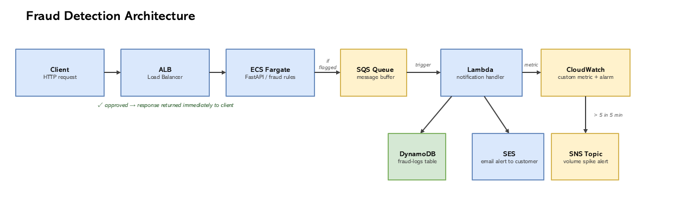

# Demo Banking Fraud Detection & Customer Notification System

A cloud-native banking application that detects potentially fraudulent transactions in real time and notifies customers. 

### Live API base URL:
http://infras-fraud-jfxleagloavq-81695362.us-east-1.elb.amazonaws.com/

## Architecture Overview



The system has two core components:

**Transaction Processing API (ECS Fargate)** : A FastAPI REST API running in a Docker container on ECS Fargate, exposed via an Application Load Balancer. It evaluates incoming transactions against fraud detection rules and returns an immediate decision. If a transaction is flagged, it pushes an event to an SQS queue before returning.

**Customer Notification & Record-Keeping (Lambda)**  : A Lambda function triggered automatically by SQS messages. It writes flagged transactions to DynamoDB and sends an email alert via SES.

SQS decouples the two components — the API responds to the customer immediately regardless of whether downstream processing succeeds, and Lambda failures result in automatic retries rather than customer-facing errors.


---

## Fraud Detection Logic

Three rule-based checks evaluated in sequence, with the first rule to fire determining the outcome.

**Rule 1: Large withdrawal threshold**
Any withdrawal over $10,000 is flagged. The threshold is defined as a named constant rather than hardcoded inline, making it easy to adjust. In production this would likely be configurable per customer or per institution.

**Rule 2: Location/Geographic velocity**
If the same account transacts from two different locations within 30 minutes, it gets flagged, intended to catch stolen card usage across regions. The current implementation tracks recent transactions in-memory. In production this could use a shared cache like Redis to work correctly across multiple instances and survive container restarts.

**Rule 3: Failed login attempts**
More than 3 failed logins before a transaction triggers a flag, simulating a brute-force login followed by an immediate transaction attempt.


---

## CloudWatch Volume Alarm

In addition to per-transaction SES alerts, a CloudWatch alarm monitors fraud volume over time. Lambda publishes a custom metric (`FraudDetection/FlaggedTransactions`) on each flagged transaction. If more than 5 occur within a 5-minute window, an SNS notification fires.

The 5-minute window was chosen to make the alarm testable and to catch spikes quickly. In production, both the threshold and window would be tuned against real traffic baselines.

## Deployment Steps

**Prerequisites**
- AWS account with CLI configured (`aws configure`)
- Python 3.11+
- Node.js (for AWS CDK CLI)
- Docker Desktop running locally

**1. Clone the repository**
```bash
git clone https://github.com/paigekobz/fraud-detect.git
cd fraud-detect
```

**2. Install application dependencies**
```bash
pip install -r requirements.txt
```

**3. Verify an email address in Amazon SES**

Go to AWS Console → SES → Verified Identities → Create Identity → Email address. AWS will send a verification email — click the link before deploying, otherwise email alerts won't send. SES is in sandbox mode by default, which means both the sender and recipient need to be verified addresses.

**4. Set environment variables**
```bash
export RECIPIENT_EMAIL="your-email@example.com"
```

**5. Install CDK and deploy**
```bash
npm install -g aws-cdk
cd infrastructure
python3 -m venv .venv
source .venv/bin/activate        # Windows: .venv\Scripts\activate
pip install -r requirements.txt
cdk bootstrap                    # one-time setup per AWS account
cdk deploy
```

CDK will build the Docker image, push it to ECR, and prepare all AWS resources.  The deploy output prints the public load balancer URL.

**Local resource requirements:** Running `cdk deploy` locally requires enough free RAM for the CDK synthesis and Docker build steps to run simultaneously. If the deploy hangs or crashes with a memory error, use AWS CloudShell as it runs entirely on AWS infrastructure with no local resource constraints, and already has AWS credentials configured automatically.

**6. Confirm the SNS subscription**

After deploying, check your inbox for an email from AWS Notifications with subject "AWS Notification - Subscription Confirmation" and click the confirm link. This is required before the CloudWatch volume alarm can send alerts.

**7. Verify the deployment**
```bash
curl http://<your-load-balancer-url>/health
# Expected: {"status":"healthy"}
```

---

## API Usage

### Health check
GET /health
Used by the ALB to confirm the container is alive. Returns `{"status": "healthy"}`.

### Submit a transaction
POST /transaction

Content-Type: application/json

**Request body**
```json
{
  "account_id": "ACC123",
  "amount": 15000.00,
  "transaction_type": "withdrawal",
  "location": "Vancouver",
  "timestamp": "2024-01-15T10:30:00",
  "failed_login_attempts": 0
}
```

| Field | Type | Required | Notes |
|---|---|---|---|
| account_id | string | yes | |
| amount | float | yes | |
| transaction_type | string | yes | one of `withdrawal`, `deposit`, `transfer` |
| location | string | yes | |
| timestamp | datetime | yes | ISO 8601 format |
| failed_login_attempts | integer | no | defaults to 0 |

**Response: approved**
```json
{
  "transaction_id": "d40f7410-d0af-4def-8917-4a04fa5c8846",
  "account_id": "ACC456",
  "amount": 500.0,
  "status": "approved",
  "reason": null,
  "timestamp": "2024-01-15T12:00:00"
}
```

**Response: flagged**
```json
{
  "transaction_id": "678d37ea-c44c-4d5c-b7ae-02d8166310ed",
  "account_id": "ACC123",
  "amount": 15000.0,
  "status": "flagged",
  "reason": "Withdrawal of $15000.0 exceeds threshold of $10000.0",
  "timestamp": "2024-01-15T10:30:00"
}
```

When a transaction is flagged, Lambda automatically writes a record to DynamoDB and sends an email alert via SES. 


### References

- [AWS CDK Python API reference](https://docs.aws.amazon.com/cdk/api/v2/)
- [Lambda + SQS event source documentation](https://docs.aws.amazon.com/lambda/latest/dg/with-sqs.html)
- [boto3 documentation](https://boto3.amazonaws.com/v1/documentation/api/latest/index.html)
- [FastAPI documentation](https://fastapi.tiangolo.com/)

